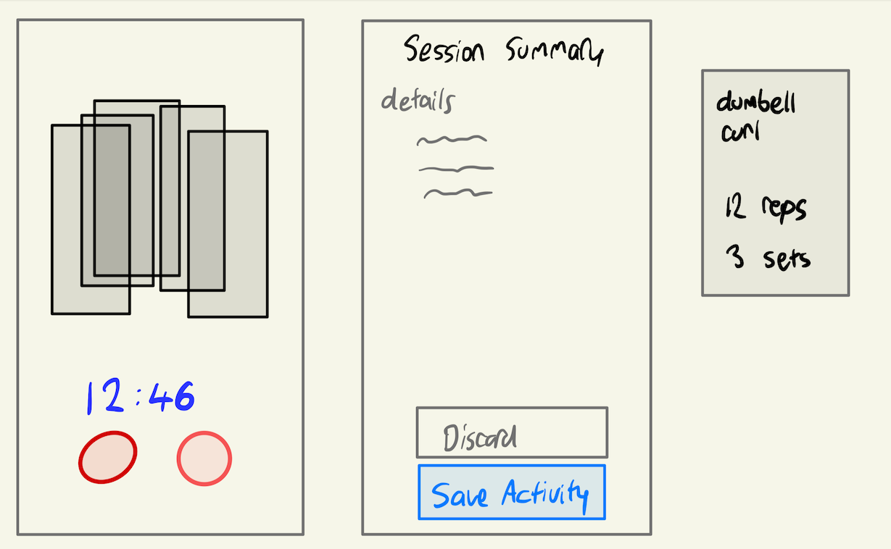

| Outline        |                               |
| -------------- | ----------------------------- |
| Course         | SEG 4105                      |
| Material       | Lab 4                         |
| Student        | Khai Tran                     |
| Student Number | 300112587 ktran093@uottawa.ca |

# Feature - Sessions

This feature allows users to actively engage with their workouts, track their progress in real-time, and have a seamless experience while transitioning between exercises. It shows the elapsed time of their workout and what exercises are coming up along with details of the exercise.

## Fat Marker Sketches

