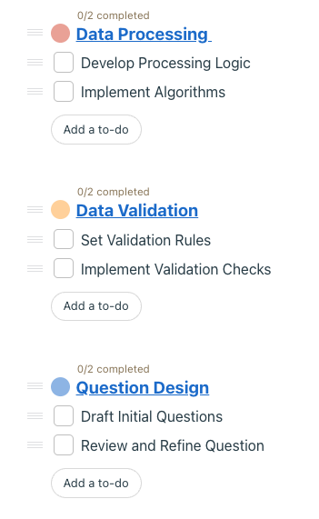

| Outline        |                               |
| -------------- | ----------------------------- |
| Course         | SEG 4105                      |
| Material       | Lab 6                         |
| Student        | Khai Tran                     |
| Student Number | 300112587 ktran093@uottawa.ca |

Workout Generation is broken down into 5-main components (scope)

1. Endpoints
2. Data Collection
3. Algorithm
4. UI
5. Survey

The main features of Data Collection include:

- Question Design

  - how questions will be phrased with clarity
  - how questions will cater to different fitness levels and goals

- Data Validation

  - ensure collected data is valid and consistent

- Data Processing

  - translating survey data into data that the workout generation algorithm can use
  - ensuring processing is efficient and error-free

### Mapping Progress

link to Bootcamp: https://3.basecamp.com/5682135/buckets/34775358/todosets/6656006622
